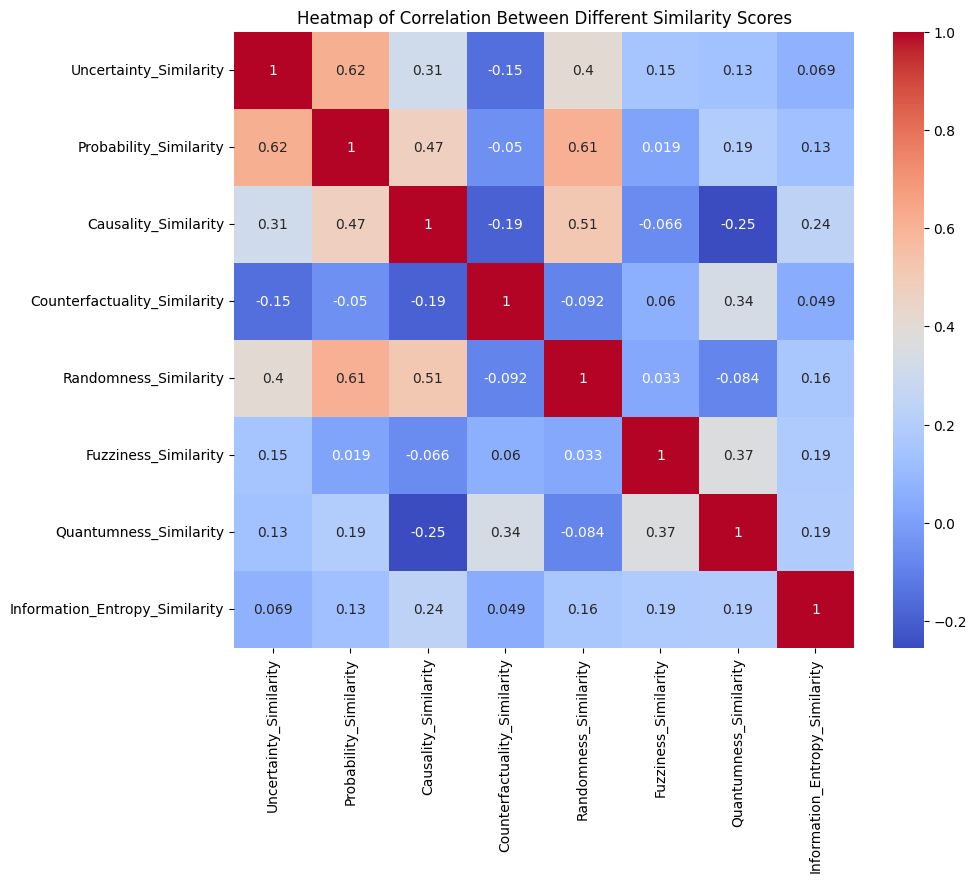

# Semantic Similarity Analysis in Knowledge Graphs

## Project Name: SemanticGraphSim

## Motivation

The goal of this project, SemanticGraphSim, is to explore the semantic similarities between various concepts related to uncertainty within a corpus of academic papers. The motivation behind this analysis is to understand how different aspects of uncertainty, such as probability, causality, counterfactuality, and others, interrelate in the context of knowledge graphs and reasoning.

Knowledge graphs are a pivotal component of modern AI systems, providing structured semantic frameworks that facilitate reasoning over complex datasets. However, the concept of uncertainty presents unique challenges in this domain. By quantifying the semantic similarity of academic papers to various facets of uncertainty, we aim to uncover underlying patterns and insights that could inform future research and applications in knowledge graph refinement and uncertainty modeling.

## Analysis

The project utilizes the Universal Sentence Encoder (USE) to generate embeddings for each document, capturing the nuanced semantic meanings of the text. Using these embeddings, we calculate cosine similarity scores for each paper against key uncertainty-related terms: "uncertainty," "probability," "causality," and more.

We then extend our analysis to visualize the correlation between these similarity scores and to identify papers that are most closely associated with each aspect of uncertainty. This approach allows us to not only see individual relationships but also how these concepts interact as a whole within the field.

## Conclusions

The analysis revealed that:

- Certain concepts, such as "uncertainty" and "probability," often exhibit a strong positive correlation, indicating their frequent co-occurrence and potential overlap in the context of knowledge graphs.
- Other concepts show a more diverse range of relationships, highlighting the multifaceted nature of uncertainty in academic discourse.
- By identifying papers with the highest total similarity scores, we can pinpoint key research that significantly contributes to the dialogue on uncertainty in knowledge graphs.

Through SemanticGraphSim, we've taken an important step toward a deeper understanding of uncertainty in knowledge graphs, offering a foundation for future explorations into how these insights can be applied to enhance AI reasoning and decision-making under uncertainty.

---

For more information, updates, and contributions, please consider starring and forking this repository.

SemanticGraphSim
